# FoodBridge – Local Food Wastage Management System

Interactive Streamlit dashboard for analyzing food wastage, food listings, providers, receivers, claims, and distribution trends using Python, SQL, Pandas, and Plotly.

## Live Dashboard

https://food-wastage-management-system-sr5nozttmwuufffgghmhur.streamlit.app/

## System Architecture

## Dashboard Features

- KPI Overview Cards
- Provider Type Analysis
- Food Type Distribution
- Meal Type Distribution
- Claims Status Analysis
- Geographic Intelligence
- Monthly Trend Analysis
- Interactive Filters
- Search & Data Explorer
- CSV Export Functionality

## Technology Stack

- Python
- Streamlit
- Pandas
- NumPy
- Plotly
- SQL
- Scikit-Learn

## Dataset Files

- food_listings_data.csv
- providers_data.csv
- receivers_data.csv
- claims_data.csv

## Project Objective

Reduce food wastage by connecting surplus food providers with NGOs, shelters, and community organizations through an interactive analytics platform.

## Author

Aman
BSc Clinical Research Internship Project
